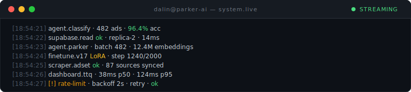
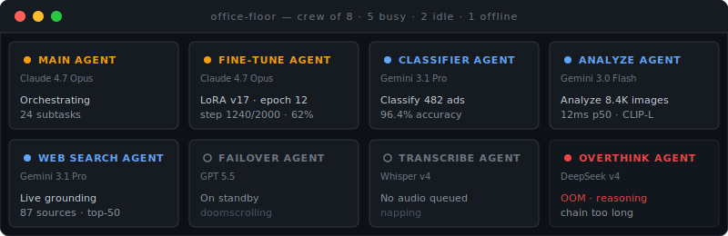

# Dalin Huang

### Senior Full Stack Developer / AI Developer

Building AI agent platforms at **Parker AI**. Async pipelines that process billions of data points a day. Fine-tunes open-weight LLMs with LoRA. Eleven years shipping production systems — backend, frontend, and the weird stuff in between.

  

  

  

---

**→ [dalin.dev](https://dalin.dev)** · Three.js System Map · live terminals · built with Claude Opus 4.7

  
